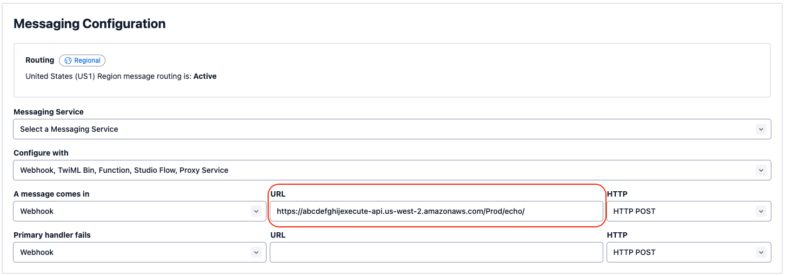

# Reference Architecture: Twilio SMS & AWS Lambda Integration

This repo implements a basic reference architecture for creating an SMS gateway using:
- Twilio
- AWS Lambda
- AWS API Gateway

After following the steps in this repo, we will have a simple SMS-based integration that will
echo text messages sent to a Twilio-provided number. The integration is relatively bare-bones, but
will include:
- The ability to receive/respond to messages
- Message signature verification
- Integration with Twilio via TwiML and the Twilio Python SDK

## Prerequisites

Before being able to deploy the resources in this repo, you should have the following:
- A Twilio account, and subsequent purchase of an SMS-enabled phone number
- An AWS account, with credentials available to commands run as part of this README
- The [AWS SAM CLI][sam-cli] installed

## Setup

### Step 1: Deploy the Application

Run the following command in `./twilio-sms-lambda-reference`:
```
$ make build deploy
```

Take note of the API Endpoint URL as shown below. This will be used in the following step:


### Step 2: Configure the Webhook

In the Twilio console, under Phone Numbers > Manage > Active numbers > (select) > Configure,
add the webhook from the previous step under "Messaging Configuration"


### Step 3: Add Twilio Auth Token

In order to validate that our Lambda is receiving real, unmodified hooks from Twilio, we need to
provide our function with our auth token. This requires retrieving the token from the Twilio
console, and then uploading it to AWS Secrets Manager in the AWS Console.

First, in the Twilio console, navigate to Account > API keys & tokens > Live credentials, and then
click on the eye to reveal your auth token:


Next, log into the AWS console and navigate to the Secrets Manager console. Then select the secret
with the name of `twilio-sms-lambda-reference-twilio-auth-token`.

Click "Retrieve secret value" and then "Edit", and save the Twilio auth token we retrieved
previously:


### Step 4: Validate

With this, everything should be in place to test things out. Send an SMS to your Twilio-registered
number and if all is well, you will receive a response!


## Notes

- The API Gateway configuration used here takes advantage of an externally-defined OpenAPI spec
  ([api.yaml](./twilio-sms-lambda-reference/api.yaml)). While this is less convenient than using
  native SAM events, it's the easiest way to define the required integration mappings to convert
  to/from Twilio's webhook format

[sam-cli]: https://docs.aws.amazon.com/serverless-application-model/latest/developerguide/install-sam-cli.html
